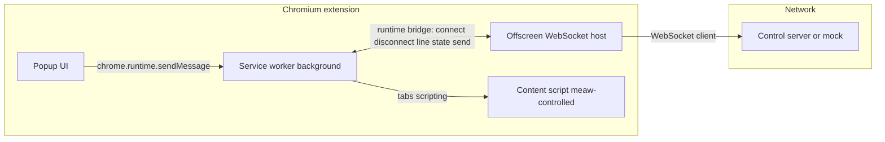

# Agent and contributor guide — Meaw Machine

This document orients AI agents and humans working on the **Meaw Machine** Chromium extension: what it does, how runtime pieces connect, and where to implement changes. For the full WebSocket **v1 protocol** (JSON envelopes, actions, limitations), use [README.md](README.md) as the source of truth.

## Purpose

Manifest **V3** extension that:

- Keeps a **WebSocket** to an external **control server** (implementation is **out of scope** for this repository).
- Executes remote commands on tabs (navigate, close, screenshot, read page content, release control).
- Injects a **visible bar** on pages that are under remote control.

The production LLM/control backend lives elsewhere; this repo ships the **extension** and a **local mock server** for integration testing.

## Tech stack

| Item | Notes |
|------|--------|
| Runtime / package manager | [Bun](https://bun.sh/) (see `packageManager` in [package.json](package.json)) |
| Extension tooling | [WXT](https://wxt.dev/) — entrypoints under `entrypoints/` |
| Language | TypeScript, `strict: true` ([tsconfig.json](tsconfig.json)), `chrome` types |
| Build output | `.output/chrome-mv3` — load unpacked in Chromium for development |

Common commands:

- `bun install` — dependencies
- `bun run dev` — WXT watch
- `bun run build` — production bundle
- `bun run check` — `tsc --noEmit` (run before finishing substantive changes)
- `bun run mock-server` — local Elysia server with WebSocket + `POST /command` ([mock-server/index.ts](mock-server/index.ts))

## Architecture

The **service worker** cannot reliably hold a long-lived WebSocket in MV3, so the socket runs in an **offscreen document**. Messages between UI, worker, offscreen, and content scripts are typed in [utils/bridge-messages.ts](utils/bridge-messages.ts); WebSocket **protocol** shapes live in [utils/protocol/messages.ts](utils/protocol/messages.ts).

Key entrypoints:

| Role | Path |
|------|------|
| Service worker (command routing, tab control) | [entrypoints/background.ts](entrypoints/background.ts) |
| Offscreen socket + reconnect | [entrypoints/offscreen/main.ts](entrypoints/offscreen/main.ts) |
| Popup connect / disconnect / status | [entrypoints/popup/main.ts](entrypoints/popup/main.ts) |
| Controlled-tab UI and page reads | [entrypoints/meaw-controlled.ts](entrypoints/meaw-controlled.ts) |

## Where to implement changes

| Goal | Primary locations |
|------|-------------------|
| New or changed **command actions**, tab/page behavior | `executeServerCommand` and handlers in [entrypoints/background.ts](entrypoints/background.ts); protocol types in [utils/protocol/messages.ts](utils/protocol/messages.ts); keep [mock-server/index.ts](mock-server/index.ts) and [README.md](README.md) aligned when the protocol changes |
| **Socket** lifecycle, reconnect, forwarding lines to the worker | [entrypoints/offscreen/main.ts](entrypoints/offscreen/main.ts) |
| **Popup** UX, persisted URL | [entrypoints/popup/main.ts](entrypoints/popup/main.ts), [utils/storage-keys.ts](utils/storage-keys.ts) |
| **Manifest** permissions / metadata | [wxt.config.ts](wxt.config.ts) |

Internal Chrome messaging kinds (connect, disconnect, status, socket lines) are centralized in [utils/bridge-messages.ts](utils/bridge-messages.ts).

## Protocol and documentation

Do **not** duplicate the full protocol here. Read **WebSocket protocol (v1)**, **Permissions**, and **Limitations** in [README.md](README.md). When you add actions or fields, update types and docs together.

## Local integration testing

Follow **Mock control server** in [README.md](README.md): start `bun run mock-server`, obtain `wsUrl` (e.g. from `/health` or OpenAPI), paste it in the extension popup and connect, then send commands via `POST /command` as documented.

## Repository conventions

- **English** for documentation, comments, and identifiers.
- **Import sections** with comments (e.g. `//* Libraries imports`, `//* Local imports`) matching existing files.
- **HTML buttons**: include `id` and `type`.
- Prefer **padding** over **margin** in CSS/Tailwind when adjusting layout.
- Avoid unnecessary scope creep: match existing patterns and change only what the task requires.

## Quality gate

Run `bun run check` after edits. There is **no** automated test suite in this repository yet (no `*.test.*` / `*.spec.*` files); rely on typecheck and manual extension loading from `.output/chrome-mv3`.

## Out of scope

The real **LLM control server** that speaks this WebSocket protocol is not part of this repo. This project delivers the browser extension and the optional **mock-server** for development.
